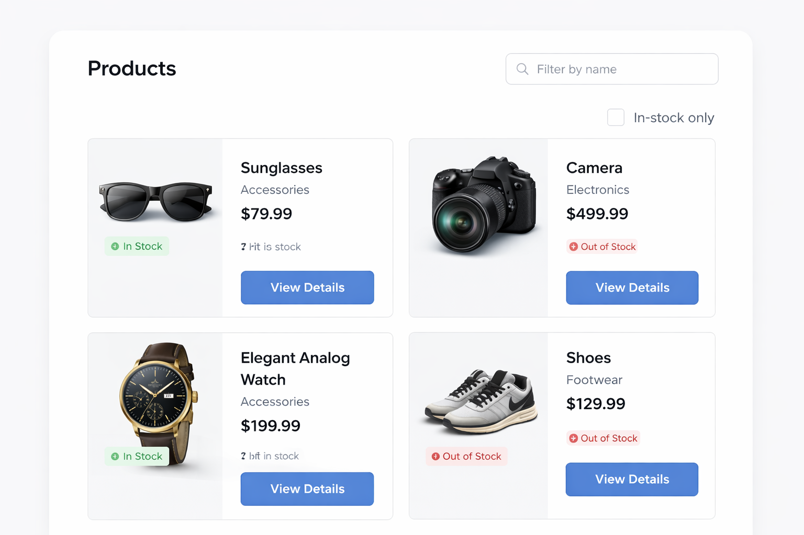
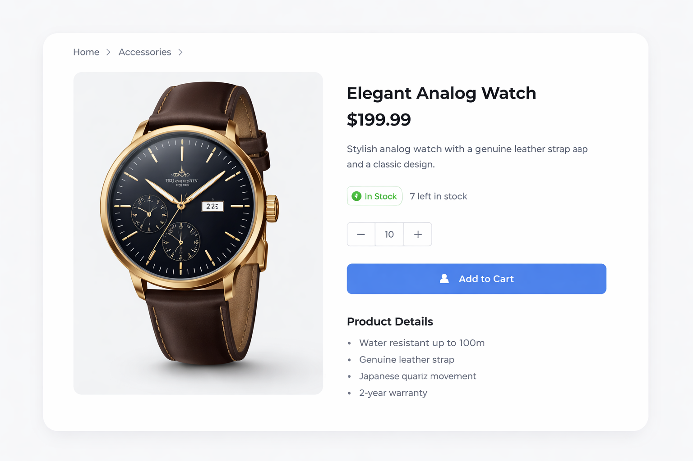

# Angular Coding Challenge


# Dev Updates

# Coding Session Progress

## Completed

- Building components to match the UX design -- Done.
- Ensured the website is responsive-- Done.
- Implemented standalone components (Angular 21)-- Done.
- Created and used a reusable filter component-- Done.
- Used Signal Inputs and two-way bound Model Inputs-- Done.
- Used TypeScript with proper typing-- Done.
- Improved Angular routing for a cleaner application experience-- Done.
- Async data handling with `HttpClient`-- Done.

---

## Project Overview

## Features Implemented

- Updated the **Items** view to load data from `/assets/items.json`-- Done.
- Implemented filtering in the items listing-- Done.
- Clicking an item in the listing navigates to the **Item Detail** page-- Done.
- Completed `item.service.ts` by implementing all stub methods-- Done.

## Overview

Welcome! This is a **30–45 minute coding challenge** designed to test your Angular skills, including:

- Standalone components (Angular 21)
- TypeScript and typing
- Angular routing
- Async data handling with `HttpClient`
- Basic HTML/CSS and conditional rendering

You will work with a small app that displays a list of items and their details. Some items are **out of stock**, and your task is to extend the app with filtering and UI improvements.

To give you some inspiration for the UI, here are two examples:

2. **Product Listing Page**
   

   > Example of a responsive product grid with multiple items, prices, and in-stock badges.
   >
3. **Modern Product Preview**
   

   > Example of a single product detail layout with clean typography, stock info, and actionable buttons.
   >

These images are **for inspiration only**. You do not need to replicate them exactly, but consider similar layout, spacing, and style in your implementation.

---

## Setup

The app is fully standalone — no NgModules required.

### Running the App

**Option 1: StackBlitz**

1. Open the project in StackBlitz.
2. The app should load automatically in the preview window.

**Option 2: Local Development**

```bash
# Install dependencies
npm install

# Start development server
ng serve
```

